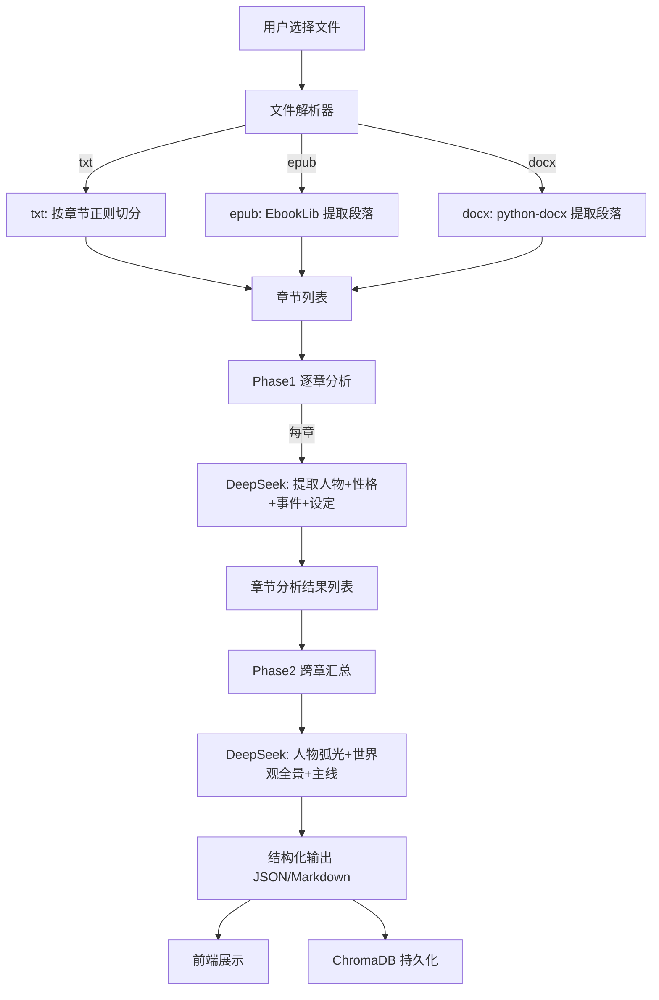

# 小说分析提取器 — 设计文档

> 日期：2026-07-17
> 状态：设计已定稿

## 背景与问题

用户希望搭建一个个人用的本地工具：选择一个小说文件（txt / epub / docx），自动提取文本内容，用 DeepSeek API 分析出**世界观设定**和**人物性格转变**等结构化信息。

现有项目骨架（`novel-extractor`）已有 Flask + ChromaDB + OpenAI SDK 依赖和 DeepSeek 配置模板，但尚未实现任何业务逻辑。没有 git 仓库，`src/` 下仅有一个 `config.py`。

**问题为什么存在**：市面上没有直接做"小说世界观+人物弧光提取"的现成工具。通用 AI 聊天界面可以手动粘贴文本请 AI 分析，但体验极差——需要手动分段、自行管理提示词、无法持久化结果。

**核心挑战**：一本小说通常 20-100 万字，远超 DeepSeek 的 128K 上下文窗口（约 10 万中文字）。不能把整本书一次发给 AI。

## 调研发现

- DeepSeek API 兼容 OpenAI SDK，`openai` 包已纳入依赖
- ChromaDB 已在依赖中，适合做向量存储和检索
- `config.py` 已定义 `CHUNK_SIZE=2000`、`CHROMA_PERSIST_DIR`、`OUTPUT_DIR`、`UPLOAD_DIR`
- 项目无测试、无路由、无前端、无 git

## 方案对比

| 方案 | 核心选择 | 优势 | 代价 | 结论 |
|------|----------|------|------|------|
| V1 全量分析 | 整本书一次发给 DeepSeek | 实现极简 | 上下文窗口无法容纳长篇小说 | 淘汰 — 硬约束 |
| V2 两阶段分析 | Phase1 逐章提取摘要 → Phase2 跨章汇总 | 兼顾单章精度与全局视角 | 需良好分块策略 | **存活（推荐）** |
| V3 RAG 增强 | 向量库存储 → 分析时检索相关块 | 理论上更精准 | 过度设计，个人工具不划算 | 淘汰 — 复杂性过高 |

## 最终方案（V2：两阶段分析）

### 核心设计

```
用户上传文件 → 文件解析 → 章节分块 → Phase1: 逐章 AI 提取 → Phase2: 跨章 AI 汇总 → 结果展示
```

### 数据流



### 边界标定

**会碰的文件**：

| 文件 | 做什么 |
|------|--------|
| `src/config.py` | 扩展配置项（分析维度、模型名等） |
| `src/app.py` | **新建** — Flask 应用入口、路由注册 |
| `src/parser.py` | **新建** — 文件解析器（txt/epub/docx → 章节文本） |
| `src/analyzer.py` | **新建** — 两阶段 AI 分析核心 |
| `src/prompts.py` | **新建** — DeepSeek 提示词模板 |
| `src/store.py` | **新建** — ChromaDB 存储封装 |
| `src/templates/index.html` | **新建** — 前端主页面 |
| `src/static/style.css` | **新建** — 前端样式 |
| `src/static/app.js` | **新建** — 前端交互逻辑 |
| `pyproject.toml` | 补充新依赖（EbookLib、python-docx） |

**不改什么**：现有的 `config.py` 只扩展不破坏。`pyproject.toml` 只追加依赖不删改。

### 注入点

**1. 文件解析（`parser.py`）**

当前行为：无文件解析能力。
改后行为：`parse(file_path, file_type) → List[Chapter]`，其中 `Chapter = {title, content, index}`。

三种格式的解析策略：
- **txt**：按章节标题正则匹配切分（匹配 `第[一二三四五六七八九十百千\d]+章`、`Chapter \d+` 等模式）。若无章节标记，按固定长度（约 5000 字）切分。
- **epub**：EbookLib 提取所有 HTML 段落，按 `<h1>-<h4>` 标签识别章节边界，纯文本段落合并为正文。
- **docx**：python-docx 提取段落，按加粗/大号字体段落识别章节标题。

安全：纯文本提取，不执行任何代码。epub 的 HTML 标签全量剥离。

**2. AI 分析（`analyzer.py`）**

Phase 1 — 逐章分析：
- 输入：单章文本（< 8000 字，确保 DeepSeek 回复也在上下文内）
- 提示词：要求输出 JSON 格式的 `{characters, world_elements, plot_points}`
- 每章独立调用，失败重试 3 次

Phase 2 — 跨章汇总：
- 输入：所有章的 Phase 1 结果拼接（已是结构化摘要）
- 提示词：要求输出 `{character_arcs, world_map, main_themes, timeline}`
- 单次调用，上下文足够容纳摘要

**3. 向量存储（`store.py`）**

每章的分析结果存入 ChromaDB，支持按人物名/设定关键词检索。持久化到 `./chroma_data`。

**4. 前端 UI**

单页应用，三个区域：
- 上传区：拖拽/点击选择文件，显示文件名和解析进度
- 进度区：显示当前分析阶段（解析→Phase1 第 x/n 章→Phase2 汇总）
- 结果区：Tab 切换（人物弧光 / 世界观图谱 / 主线梳理 / 原始 JSON）

### 提示词策略

Phase 1 逐章提示词核心约束：
- 输出**必须**是合法 JSON
- 人物条目包含 `name, aliases, traits, actions, dialog_style`
- 世界观条目包含 `category, name, description, evidence`
- 情节条目包含 `type, summary, involved_characters`

Phase 2 汇总提示词核心约束：
- 跨章跟踪同一人物的性格变化（识别别名/指代）
- 世界观按类别归并（地理、势力、规则、历史等）
- 输出人物的"性格转变弧光"：初始状态 → 关键事件 → 转变后状态

### 技术选型

- 后端：Flask（已有依赖），无新增框架
- 文件解析：EbookLib（epub）+ python-docx（docx）+ 原生（txt）
- AI 调用：openai SDK → DeepSeek 兼容端点
- 向量存储：ChromaDB（已有依赖）
- 前端：原生 HTML/CSS/JS，无框架

## 先例引用

无。这是 greenfield 项目。

## 风险与应对

| 风险 | 应对 |
|------|------|
| txt 无章节标记导致分块过大 | 降级为固定 5000 字切分，保证单块不超 DeepSeek 上下文 |
| DeepSeek API 返回非 JSON | 解析失败时重试 3 次，仍失败则保存原始文本供人工查看 |
| epub 格式不规范 | EbookLib 异常时提示用户"文件格式不兼容"，不崩溃 |
| 分析耗时过长（百章小说） | 前端轮询进度；Phase1 可考虑并发（后期优化） |

## 依赖补充

需在 `pyproject.toml` 的 dependencies 中追加：
```
"ebooklib>=0.18",
"python-docx>=1.1",
"beautifulsoup4>=4.12",
```

## 下一步

调用 `writing-plans` 生成执行计划，按模块分批实现。
